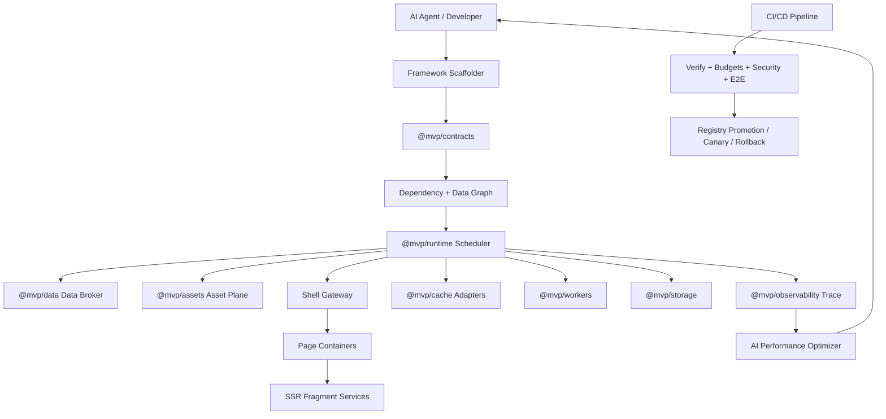

# AI Native Production Ready Framework Plan

Last updated: 2026-07-05

## 1. Objective

Build this repository into an AI-native frontend framework where AI can continuously generate, validate, release, observe, and optimize production code for independently deployable shell, page, and SSR fragment services.

The target system must support:

- Fast AI-assisted feature generation with contracts, scaffolding, TDD, and quality gates.
- Automated release and rollback for shell, page apps, fragments, and shared packages.
- Automatic performance discovery and optimization across SSR, SSG, ISR, network, assets, data freshness, cache, and dependency graph.
- Framework-owned common capabilities: trace, public CSS/JS/font/theme/i18n, data plane, request plane, storage, cookies, workers, background jobs, and cross-container interaction.
- Explicit data classification for realtime, near-realtime, request-time, cached, ISR, SSG, and static data so rendering frequency is controlled by data semantics rather than ad hoc component code.

This document is the planning source of truth for follow-up implementation. Do not implement everything at once; each phase below should be delivered with TDD and a measurable verification gate.

## 2. Current Baseline

The current MVP already has useful foundations:

- Monorepo structure: `apps`, `fragments`, `packages`, `tools`, `docs`, `infra`.
- Independent deployable shell, page, and fragment packages.
- `@mvp/contracts` with Zod schemas for request context, manifests, registries, budgets, render requests, and render responses.
- `@mvp/runtime` with route/fragment resolution, parallel fragment slot fetching, timeout, fallback, cache, asset merge, and render strategies.
- `@mvp/request-context` with tenant, locale, theme, device, flags, trace IDs, and safe serialization.
- `@mvp/observability` with request trace nodes, edges, durations, and dependency graph logs.
- Design tokens, CSS budget, bundle budget, dependency audit, server/client boundary audit, component similarity audit.
- Docker Compose for shell, page, and fragment services.
- Demo coverage for static, cached SSR, ISR-like cached SSR, dynamic SSR, fallback, trace display.

The major gaps are:

- `dependsOn` exists only as metadata; runtime scheduling is not yet a real DAG.
- Data dependencies are not declared or resolved by a unified data plane.
- SSG/ISR is slot-oriented and not yet a page-level build/revalidation system.
- Cache is in-memory and not pluggable across memory, Redis, CDN, Next cache, and service worker cache.
- Asset handling is not yet a governed asset plane for global CSS, fragment CSS, JS, fonts, theme, i18n, CSP, SRI, preload, and load order.
- Request handling is still partly component-owned; no framework fetch/data broker yet.
- No first-class shell/page/fragment singleton context APIs.
- No worker abstraction for service worker, web worker, shared worker, server background worker, or queue worker.
- Cookie/storage APIs are not centralized or policy-controlled.
- Release automation is documented but not implemented as a CI/CD pipeline with promotion gates, canaries, smoke tests, and rollback.

## 3. External Research Summary

### 3.1 Svelte and SvelteKit Data/Reactive Model

Svelte 5 separates reactive state, derived values, and side effects through runes. `$state` marks values that should trigger UI updates, `$derived` computes side-effect-free derived data, and `$effect` runs after DOM updates and does not run during SSR. Svelte's own guidance is to mark only values that should cause UI updates as reactive. This is directly relevant: our framework should classify data by update semantics so realtime data does not force rerender of static or cacheable slots. Sources: Svelte `$state`, `$derived`, `$effect`, and best practices docs. [Svelte `$state`](https://svelte.dev/docs/svelte/%24state), [Svelte `$derived`](https://svelte.dev/docs/svelte/%24derived), [Svelte `$effect`](https://svelte.dev/docs/svelte/%24effect), [Svelte best practices](https://svelte.dev/docs/svelte/best-practices).

SvelteKit's `load` model provides a strong lesson for dependency tracking. `fetch` automatically registers dependencies, custom clients can call `depends(...)`, and invalidation reruns only the relevant loads. SvelteKit performance docs also call out data inlining, conservative invalidation, route-level prerendering, and link preloading. Sources: [SvelteKit load](https://svelte.dev/docs/kit/load), [SvelteKit performance](https://svelte.dev/docs/kit/performance), [SvelteKit `depends`](https://svelte.dev/docs/kit/%40sveltejs-kit).

Framework implication:

- Introduce a `DataDependency` contract with explicit data freshness and invalidation keys.
- Treat component rerender scope as a function of data class: static data should not subscribe to realtime channels; realtime streams should update client islands or fragment subtrees only.
- Provide a framework `depends()` equivalent for custom API clients.

### 3.2 SWR Data Model

SWR's relevant primitives are: stable request key, centralized cache, deduplication, revalidation on focus/reconnect, mutation, and subscription for realtime sources. SWR docs explicitly call out caching and request deduplication, automatic revalidation, and subscriptions. Sources: [SWR overview](https://swr.vercel.app/), [SWR revalidation](https://swr.vercel.app/docs/revalidation), [SWR performance](https://swr.vercel.app/docs/advanced/performance), [SWR subscription](https://swr.vercel.app/docs/subscription).

Framework implication:

- Components should not issue unrelated raw requests by default.
- The framework should provide a server/client data broker:
  - Request key construction.
  - Deduplication within a render pass.
  - Cache lookup and background revalidation.
  - Realtime subscription routing.
  - Mutation invalidation.
  - Trace integration.
- Components may provide fetchers, but the framework owns policy, cache, tracing, security, and invalidation.

### 3.3 Next.js and React Server Data/Caching

React Server Components can run at build time or per request, while React `cache()` memoizes work shared across server components. Next extends server `fetch()` with persistent caching and revalidation semantics, supports route/component/function caching, tag-based revalidation, ISR, CDN caching with stale-while-revalidate, and warns about multi-instance cache coordination. Sources: [React Server Components](https://react.dev/reference/rsc/server-components), [React `cache`](https://react.dev/reference/react/cache), [Next fetch](https://nextjs.org/docs/app/api-reference/functions/fetch), [Next caching](https://nextjs.org/docs/app/getting-started/caching), [Next ISR](https://nextjs.org/docs/app/guides/incremental-static-regeneration), [Next revalidation model](https://nextjs.org/docs/app/guides/how-revalidation-works), [Next CDN caching](https://nextjs.org/docs/app/guides/cdn-caching).

Framework implication:

- Provide a framework cache abstraction with adapters rather than binding only to in-memory maps.
- Add explicit tag invalidation and distributed invalidation hooks.
- Support static shell + streamed dynamic slots.
- Preserve route-level compatibility between static and dynamic policies.

### 3.4 Workers, Storage, Cookies, and Browser State

MDN defines several worker types: dedicated workers for one script, shared workers used by multiple same-origin scripts, and service workers as a network proxy layer for offline, request interception, push, and background sync. Service worker and PWA APIs can use Cache storage for offline assets and responses. MDN also documents state partitioning across localStorage, sessionStorage, Cache, IndexedDB, BroadcastChannel, Shared Workers, and Service Workers. Sources: [MDN Web Workers](https://developer.mozilla.org/zh-CN/docs/Web/API/Web_Workers_API), [MDN SharedWorker](https://developer.mozilla.org/en-US/docs/Web/API/SharedWorker), [MDN PWA reference](https://developer.mozilla.org/en-US/docs/Web/Progressive_web_apps/Reference), [MDN PWA offline operation](https://developer.mozilla.org/en-US/docs/Web/Progressive_web_apps), [MDN state partitioning](https://developer.mozilla.org/en-US/docs/Web/Privacy/Guides/State_Partitioning).

Framework implication:

- Provide `@mvp/workers` for:
  - Browser dedicated worker tasks.
  - Shared worker singleton channels.
  - Service worker offline/cache/update lifecycle.
  - Server background worker / queue worker interface.
- Provide `@mvp/storage` for policy-controlled cookie, localStorage, sessionStorage, IndexedDB, Cache API, memory storage, and server storage.
- Respect partitioning, tenant, locale, user, and privacy policies in cache/storage keys.

### 3.5 Production Readiness and Software Engineering Standards

NIST SSDF recommends secure software development practices that can be integrated into SDLC workflows. OWASP ASVS provides testable web application security controls. Google SRE's Production Readiness Review model focuses on service reliability before production ownership, while monitoring guidance emphasizes actionable monitoring and alerting. ISO/IEC/IEEE 12207 covers software lifecycle processes from conception through operation, support, and retirement. Sources: [NIST SSDF](https://csrc.nist.gov/pubs/sp/800/218/final), [OWASP ASVS](https://owasp.org/www-project-application-security-verification-standard/), [Google SRE PRR](https://sre.google/sre-book/evolving-sre-engagement-model/), [Google SRE monitoring](https://sre.google/sre-book/monitoring-distributed-systems/), [ISO/IEC/IEEE 12207:2026](https://www.iso.org/standard/90219.html).

Framework implication:

- Production readiness is not just build success. It requires requirements traceability, verification, secure development, change control, operational readiness, monitoring, rollback, incident response, and maintenance.
- Every generated component/page/fragment should ship with contracts, tests, budgets, observability, security controls, release metadata, and rollback path.

## 4. Target Architecture



## 5. Capability Domains

### 5.1 Contracts and Manifests

Add these schemas to `@mvp/contracts`:

- `AssetManifest`
- `FontManifest`
- `ThemeManifest`
- `I18nManifest`
- `DataDependency`
- `ApiEndpointPolicy`
- `InteractionContract`
- `WorkerManifest`
- `StoragePolicy`
- `CookiePolicy`
- `ReleaseManifest`
- `OptimizationFinding`

Key design:

```ts
type DataFreshness =
  | "static"
  | "build-time"
  | "isr"
  | "request-time"
  | "near-realtime"
  | "realtime"
  | "client-local";

type DataDependency = {
  id: string;
  owner: "shell" | "page" | "fragment" | "client-island";
  source: "context" | "route" | "api" | "server-function" | "worker" | "storage" | "subscription";
  freshness: DataFreshness;
  privacy: "public" | "tenant" | "user-segment" | "user-private";
  cachePolicy?: CachePolicy;
  invalidationTags?: string[];
  dependsOn?: string[];
};
```

Acceptance:

- Manifests validate in tests.
- Invalid public/private/cache combinations fail schema validation.
- Existing page and fragment manifests migrate without behavior regression.

### 5.2 Data Plane

Add `@mvp/data` as the framework-owned request/data broker.

Responsibilities:

- `defineDataSource()`
- `createDataClient(ctx)`
- `readData(key, policy)`
- `preloadData(key)`
- `mutateData(key, mutation)`
- `subscribeData(key, handler)`
- Request dedupe during SSR.
- Cache lookup/write with tags.
- Data freshness classification.
- Framework trace spans for every data read/mutation/subscription.
- API allowlist and egress policy.
- Serialize safe server data to client.

Freshness rules:

- `static`: no runtime fetch; bundled or manifest inline.
- `build-time`: generated during SSG build.
- `isr`: cached with TTL and tag invalidation.
- `request-time`: fetched during SSR request; no cross-request cache unless explicitly configured.
- `near-realtime`: poll or revalidate on focus/reconnect; bounded staleness.
- `realtime`: websocket/SSE/subscription; client island or dedicated fragment update only.
- `client-local`: local UI state or browser storage; no SSR dependency unless explicitly hydrated.

Rendering rules:

- Static/build-time data can render in SSG HTML.
- ISR data can render in cached HTML with revalidate.
- Request-time data can render SSR but blocks only its DAG branch.
- Near-realtime data should use cached SSR plus client revalidation.
- Realtime data should not force whole-page SSR; use client island, stream, or subscription boundary.
- Client-local data must not affect server HTML except via explicit hydration defaults.

Acceptance:

- Multiple components using same data key produce one network call per SSR render.
- Trace shows data dependency nodes.
- Tests prove realtime data updates only subscribed island/slot, not static slots.
- API calls outside allowlist fail in tests.

### 5.3 Dependency DAG Scheduler

Upgrade `fetchFragmentSlots()` from flat parallel scheduling to DAG scheduling:

- Build graph from `slot.dependsOn` and `data.dependsOn`.
- Validate no cycles.
- Execute independent nodes concurrently.
- Support optional vs required dependencies.
- Support timeout, fallback, and partial graph completion.
- Emit trace nodes/edges for every dependency.
- Emit optimizer hints for waterfalls.

Acceptance:

- Independent slots run concurrently.
- Dependent slots wait only for declared dependencies.
- Cycle detection fails before request execution.
- Required dependency failure marks page unhealthy or returns configured error.
- Optional dependency failure emits fallback without aborting the whole graph.

### 5.4 Asset Plane: CSS, JS, Fonts, Theme, I18n

Add `@mvp/assets` as the global asset broker.

Responsibilities:

- Merge global, page, fragment, and client-island assets.
- Load order and dedupe.
- CSS scoping policy.
- Font manifest and preload.
- Script strategy: `none`, `module`, `defer`, `worker`, `island`.
- CSP nonce and SRI support.
- Theme token injection.
- I18n namespace discovery and preload.
- Asset budget attribution.

Ownership:

- Shell owns global CSS reset, base tokens, fonts, CSP, and theme root.
- Page owns route-specific CSS and i18n namespaces.
- Fragment owns scoped CSS and declared client island JS.
- Fragment cannot inject arbitrary inline script.
- Client island JS must be declared and budgeted.

Acceptance:

- Duplicate CSS/JS/font URLs merge deterministically.
- Unsafe inline script fails audit.
- CSS budget report attributes bytes by owner.
- Demo supports light/dark/system theme and zh/en namespace loading.

### 5.5 Request Plane

Add `@mvp/request` as the framework wrapper around fetch/server calls.

Responsibilities:

- Context propagation.
- Timeout and retry policy.
- AbortSignal propagation.
- Request dedupe.
- Circuit breaker and bulkhead per endpoint.
- Rate-limit awareness.
- SSR-safe cookie forwarding rules.
- Trace spans.
- Security headers.
- Endpoint allowlist.

Decision:

- Components/fragments may define fetchers, but all network I/O should go through framework request/data clients.
- Direct `fetch()` in fragments/pages should be blocked by audit except inside approved framework packages or test fixtures.

Acceptance:

- Audit fails raw external `fetch` in business code.
- Request trace includes endpoint, status, duration, cache source, retry count, timeout.
- Endpoint policy can disable an API for a fragment.

### 5.6 App Shell, Page, and Container Singletons

Add singleton APIs:

- `createShellRuntime()`
- `createPageRuntime()`
- `createFragmentRuntime()`
- `getRuntimeContext()`
- `provideRuntimeSingleton()`

Singleton scope:

- Shell singleton: process/request safe config, asset plane, route registry, release policy, CSP, global observability.
- Page singleton: page manifest, page data loaders, slot graph, page assets, page-level i18n.
- Fragment singleton: fragment manifest, endpoint policy, local cache, render function, budget.

Rules:

- No user-private mutable state in process singletons.
- Request-scoped values must live in request context.
- Singleton lifecycle must be testable and resettable.

Acceptance:

- Tests prove request isolation under concurrent render.
- Process singleton state does not leak tenant/user/session.

### 5.7 Cross-Container Data and Interaction

Add `@mvp/interaction`.

Use cases:

- Shell action updates page state.
- Page-level filter updates multiple fragment islands.
- Fragment emits analytics or mutation event.
- Realtime data updates client island without rerendering page.
- Shared optimistic mutation invalidates multiple data dependencies.

Primitives:

- Event bus with typed channels.
- `InteractionContract` in manifest.
- Server mutation contract.
- Client subscription bridge.
- BroadcastChannel/shared worker bridge when needed.
- Trace for user interaction -> mutation -> invalidation -> rerender.

Acceptance:

- Cross-fragment event requires declared contract.
- Undeclared event channel fails audit.
- Mutation invalidates only declared tags.

### 5.8 Workers and Background Tasks

Add `@mvp/workers`.

Browser:

- Dedicated worker for CPU-heavy tasks.
- Shared worker for same-origin cross-tab singleton.
- Service worker for offline/cache/update lifecycle.
- BroadcastChannel helper.

Server:

- Background worker interface.
- Queue adapter interface.
- Scheduled job interface.
- Dead-letter and retry policy.
- Trace propagation from request to async job.

Service worker policy:

- Disabled by default.
- Enabled per app through manifest.
- Must declare cache scope, route scope, update strategy, and privacy class.

Acceptance:

- Worker tasks are typed and cancellable.
- Service worker cache cannot store user-private SSR HTML unless policy explicitly allows it and key includes user identity.
- Background job trace links to original request trace.

### 5.9 Storage and Cookies

Add `@mvp/storage`.

Storage adapters:

- Memory
- Cookie
- LocalStorage
- SessionStorage
- IndexedDB
- Cache API
- Server KV / Redis adapter

Cookie policies:

- `HttpOnly`, `Secure`, `SameSite`, domain, path, maxAge.
- Signed/encrypted cookie support.
- Request context extraction.
- No arbitrary cookie forwarding to fragments.

Storage policies:

- Privacy class.
- Tenant partition key.
- Locale/theme partition if needed.
- Expiration.
- Encryption requirement.
- SSR/client availability.

Acceptance:

- User-private data cannot use public cache/storage policy.
- Tenant partitioning is included in storage key.
- Cookie serialization and parsing covered by tests.

### 5.10 Performance Discovery and AI Optimization

Add `@mvp/optimizer` and expand reports.

Inputs:

- Trace JSON.
- Bundle/CSS budget reports.
- Dependency audit.
- Server/client boundary audit.
- Runtime cache hit rate.
- Fragment latency percentiles.
- Waterfall detection.
- Static eligibility analysis.

Outputs:

- `reports/optimization-findings.json`
- `reports/optimization-findings.md`
- Suggested code changes grouped by risk.

Optimization rules:

- Static eligibility: no user/session/cookie/request-time data, deterministic props, stable assets.
- ISR eligibility: public or tenant data with TTL and invalidation tags.
- Cached SSR eligibility: expensive but bounded staleness.
- Dynamic SSR required: user-private or request-time data.
- Client realtime island: websocket/SSE/subscription data.
- Network dedupe: same endpoint/key called more than once in one render.
- Waterfall: independent slot waits on unrelated data.

Acceptance:

- Optimizer detects duplicate network calls.
- Optimizer detects static slot that could be SSG.
- Optimizer detects uncached dynamic slot with stable public data.
- Optimizer outputs actionable finding with file/manifest references.

### 5.11 CI/CD and Automatic Release

Add production pipeline docs and scripts:

- Affected project detection.
- Test matrix per changed project.
- Docker build per deployable unit.
- SBOM and provenance where environment supports it.
- Security scans.
- Contract compatibility tests.
- E2E smoke in Docker Compose.
- Canary deploy.
- Health and synthetic checks.
- Registry promotion.
- Rollback.

Release gates:

- Typecheck, lint, format.
- Unit tests.
- Integration tests.
- E2E tests.
- Coverage thresholds.
- Budget audits.
- Security audits.
- Contract compatibility.
- Runtime smoke.
- Trace sanity.

Acceptance:

- A fragment change can publish fragment image only.
- A page change can publish page image only.
- Registry promotion can route canary/stable.
- Rollback can restore previous registry entry.

### 5.12 Production Readiness Governance

Add `docs/PRODUCTION_READINESS_REVIEW.md` and automated checks.

Checklist domains:

- Requirements and ownership.
- Architecture and threat model.
- Data classification.
- Privacy and tenant isolation.
- Failure modes and fallbacks.
- SLOs and performance budgets.
- Monitoring, alerting, tracing.
- Release and rollback.
- Incident response.
- Capacity and load.
- Security verification.
- Maintenance and retirement.

Acceptance:

- Every page/fragment has owner, SLO, budget, security policy, release path, and rollback path.
- PRR can be generated from manifests and reports.

## 6. Phased Implementation Plan

### Phase 0: Stabilize Baseline

Status: Mostly done.

Tasks:

- Keep `pnpm verify` green.
- Ensure Docker Compose smoke remains green.
- Keep trace display in home/product demos.
- Document known coverage limitation if coverage mode still stalls.

Exit criteria:

- `pnpm verify` passes.
- Docker build and smoke pass.

### Phase 1: Contracts for Data, Assets, Request, Storage, Workers

Tasks:

- Extend `@mvp/contracts` with schemas listed in section 5.1.
- Update page/fragment manifests with default asset/data/request policies.
- Add schema tests for valid and invalid policies.
- Update docs.

TDD:

- Schema validation tests first.
- Invalid policy examples must fail.

Exit criteria:

- Manifest compatibility maintained.
- Tests cover data freshness, privacy, cache, asset, cookie, worker policy validation.

### Phase 2: Data Plane and Request Broker

Tasks:

- Create `packages/data`.
- Create `packages/request`.
- Implement request key, dedupe, timeout, trace, cache delegation, endpoint allowlist.
- Migrate page/fragment internal calls to framework data/request APIs.
- Add audit rule blocking raw external fetch in business code.

TDD:

- Dedupe tests.
- Timeout/fallback tests.
- Allowlist violation tests.
- Trace span tests.

Exit criteria:

- Multiple components with same key produce one request.
- Trace includes data/request nodes.

### Phase 3: DAG Scheduler

Tasks:

- Implement topological slot/data scheduler in `@mvp/runtime`.
- Support required/optional dependencies.
- Add cycle detection.
- Add waterfall optimizer hints.

TDD:

- Independent slots run concurrently.
- Dependent slots run after parents.
- Cycle throws.
- Optional failures fallback.

Exit criteria:

- Demo includes at least one dependent slot and one shared data dependency.

### Phase 4: Asset, Theme, Font, I18n Plane

Tasks:

- Create `packages/assets`.
- Add asset manifest collector.
- Add font preload and theme token injection.
- Add i18n namespace loading.
- Add CSP/SRI script policy.
- Update demos with theme and zh/en case.

TDD:

- Asset dedupe/order tests.
- Unsafe script rejection tests.
- Theme/i18n manifest validation tests.

Exit criteria:

- Home/product show theme and locale variations.
- Asset report attributes by shell/page/fragment.

### Phase 5: Storage, Cookies, and Runtime Singletons

Tasks:

- Create `packages/storage`.
- Add cookie policies and signed cookie helpers.
- Add runtime singleton APIs.
- Add concurrent request isolation tests.

TDD:

- Cookie serialization tests.
- Tenant partition tests.
- No user-private singleton leak test.

Exit criteria:

- Shell/page/fragment access storage through framework APIs only.

### Phase 6: Interaction and Realtime

Tasks:

- Create `packages/interaction`.
- Add typed event channels.
- Add subscription data source.
- Add client island demo with near-realtime/realtime data.
- Add invalidation bridge from mutation to data cache.

TDD:

- Undeclared event channel fails.
- Realtime updates only subscribed island.
- Mutation invalidates expected tags only.

Exit criteria:

- Demo shows realtime data without rerendering static page slots.

### Phase 7: Workers and Background Jobs

Tasks:

- Create `packages/workers`.
- Add browser worker wrapper.
- Add service worker manifest and demo opt-in.
- Add server background worker interface.
- Add trace propagation to async jobs.

TDD:

- Worker task execution/cancel tests.
- Service worker policy validation tests.
- Background job retry/dead-letter tests.

Exit criteria:

- Demo has one background optimization/report job and one browser worker task.

### Phase 8: Optimizer

Tasks:

- Create `packages/optimizer`.
- Consume trace and reports.
- Generate optimization findings.
- Detect SSG/ISR/cache/realtime eligibility.
- Add markdown and JSON reports.

TDD:

- Synthetic trace fixtures produce expected findings.
- No finding for optimized graph.

Exit criteria:

- `pnpm verify` generates optimization report.

### Phase 9: CI/CD and Automated Release

Tasks:

- Add affected build/test scripts.
- Add Docker smoke script.
- Add release manifest.
- Add canary/promotion/rollback scripts.
- Add GitHub Actions or local CI templates.

TDD:

- Script tests for registry promotion/rollback.
- Docker smoke tests.

Exit criteria:

- One command can build, test, smoke, and produce a release candidate.

### Phase 10: Production Readiness Review

Tasks:

- Add PRR doc and generator.
- Map reports/manifests to PRR checklist.
- Add security verification mapping to NIST SSDF and OWASP ASVS.

TDD:

- Missing owner/SLO/security policy fails PRR.

Exit criteria:

- Every app/fragment has generated PRR status.

## 7. Over-Development Guardrails

- Build framework primitives only when there is a demo case and test.
- Prefer contracts + small adapters over large platform rewrites.
- Keep direct business logic out of framework packages.
- Do not implement a full observability backend; export trace/report artifacts first.
- Do not implement a full deployment platform; provide scriptable release gates first.
- Do not make every component realtime; realtime must be declared and scoped.
- Do not make all data framework-owned by force; allow custom fetchers behind framework policy.

## 8. First Implementation Candidates

Recommended next concrete task:

1. Add `DataDependencySchema`, `AssetManifestSchema`, `RequestPolicySchema`, and `StoragePolicySchema` to `@mvp/contracts`.
2. Add `packages/data` with SSR request dedupe and trace integration.
3. Update home/product demos to declare one shared data dependency and prove dedupe.
4. Implement DAG scheduler for slot/data dependencies.
5. Add `reports/optimization-findings.md` with one initial finding type: duplicate network request or SSG eligibility.

This sequence directly addresses the highest leverage gap: components calling their own APIs without a framework-owned data/request dependency model.

## 9. Source Index

- Svelte reactivity: [Svelte `$state`](https://svelte.dev/docs/svelte/%24state), [Svelte `$derived`](https://svelte.dev/docs/svelte/%24derived), [Svelte `$effect`](https://svelte.dev/docs/svelte/%24effect), [Svelte best practices](https://svelte.dev/docs/svelte/best-practices)
- SvelteKit data: [SvelteKit load](https://svelte.dev/docs/kit/load), [SvelteKit performance](https://svelte.dev/docs/kit/performance), [SvelteKit `depends`](https://svelte.dev/docs/kit/%40sveltejs-kit)
- SWR: [SWR overview](https://swr.vercel.app/), [SWR revalidation](https://swr.vercel.app/docs/revalidation), [SWR performance](https://swr.vercel.app/docs/advanced/performance), [SWR subscription](https://swr.vercel.app/docs/subscription)
- React/Next data and rendering: [React Server Components](https://react.dev/reference/rsc/server-components), [React `cache`](https://react.dev/reference/react/cache), [Next fetch](https://nextjs.org/docs/app/api-reference/functions/fetch), [Next caching](https://nextjs.org/docs/app/getting-started/caching), [Next ISR](https://nextjs.org/docs/app/guides/incremental-static-regeneration), [Next revalidation model](https://nextjs.org/docs/app/guides/how-revalidation-works), [Next CDN caching](https://nextjs.org/docs/app/guides/cdn-caching)
- Workers/storage: [MDN Web Workers](https://developer.mozilla.org/zh-CN/docs/Web/API/Web_Workers_API), [MDN SharedWorker](https://developer.mozilla.org/en-US/docs/Web/API/SharedWorker), [MDN PWA reference](https://developer.mozilla.org/en-US/docs/Web/Progressive_web_apps/Reference), [MDN PWA offline operation](https://developer.mozilla.org/en-US/docs/Web/Progressive_web_apps), [MDN state partitioning](https://developer.mozilla.org/en-US/docs/Web/Privacy/Guides/State_Partitioning)
- Production readiness: [NIST SSDF](https://csrc.nist.gov/pubs/sp/800/218/final), [OWASP ASVS](https://owasp.org/www-project-application-security-verification-standard/), [Google SRE PRR](https://sre.google/sre-book/evolving-sre-engagement-model/), [Google SRE monitoring](https://sre.google/sre-book/monitoring-distributed-systems/), [ISO/IEC/IEEE 12207:2026](https://www.iso.org/standard/90219.html)
