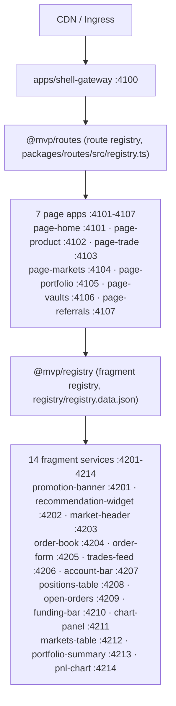

# Architecture

The MVP is a pnpm monorepo with independent deployable units: one shell
gateway, 7 Next.js page apps (4101-4107), and 14 SSR fragment services
(4201-4214), composed through two registries.

Request flow:

Shell Gateway creates request context, resolves routes through `@mvp/routes`,
forwards trace headers, applies fallback behavior, and owns global security
headers.

Page apps own SEO content, metadata, page manifests
(`src/manifest.slots.json`), and fragment slot composition. SEO-critical
content is rendered in the initial HTML.

Business fragments are SSR services with `/health`, `/metrics`, `/manifest`,
`/assets`, and `/render`. A fragment failure returns fallback HTML and does
not break page rendering.

Code is layered three ways, with imports flowing strictly downward:

- `apps/` + `fragments/` — deployable units (may import domains and packages).
- `domains/` — demo domain layer (trade-contracts, trade-data, trade-prefs,
  trade-theme, trade-chart); may import packages only.
- `packages/` — domain-agnostic `@mvp/*` framework libraries (contracts,
  runtime composition, request context, data, interaction, observability,
  design tokens, server-safe UI, ...); never import upward.
