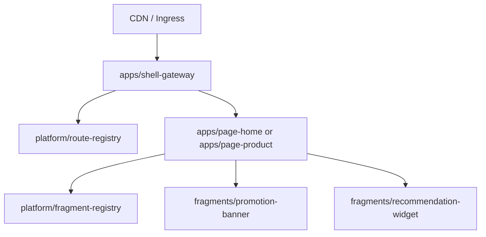

# Architecture

The MVP is a pnpm monorepo with independent deployable units.

Request flow:

Shell Gateway creates request context, resolves routes, forwards trace headers, applies fallback behavior, and owns global security headers.

Page apps own SEO content, metadata, page manifests, and fragment slot composition. SEO-critical content is rendered in the initial HTML.

Business fragments are SSR services with `/health`, `/manifest`, `/assets`, and `/render`. A fragment failure returns fallback HTML and does not break page rendering.

Shared packages provide contracts, runtime composition, request context, observability, design tokens, and server-safe UI components.
